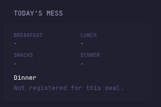

# IIITH Mess Widget for Glance

A read-only [Glance](https://github.com/glanceapp/glance) widget for the IIIT Hyderabad Mess Management System. It shows today's registrations, the ongoing or next meal at your registered mess, that meal's menu, and live registered capacity.



The mess portal is only reachable from the IIITH network. This repository includes an isolated OpenVPN sidecar and a restricted reverse proxy so only mess API requests use the college VPN. The host and all other Glance widgets keep their normal internet route.

## Features

- Today's breakfast, lunch, snacks, and dinner registrations
- Ongoing meal, or the next meal when none is currently being served
- Menu for the registered mess
- Live availability progress bar during an ongoing meal
- Automatic Asia/Kolkata day and meal selection
- GET-only proxy restricted to the four API paths used by the widget
- No host routing changes and no published proxy port

## Requirements

- A Docker-based Glance installation
- An IIITH account and current OpenVPN profile
- A Mess Portal API key from [mess.iiit.ac.in](https://mess.iiit.ac.in)
- The Glance and sidecar containers connected to the same Docker network

IIITH replaced its VPN certificates on 10 May 2026. Download the latest Ubuntu profile from [vpn.iiit.ac.in](https://vpn.iiit.ac.in/).

## Installation

### 1. Clone and configure the repository

```sh
git clone https://github.com/shouryadixitisverycool/IIITH-mess-widget.git
cd IIITH-mess-widget
cp .env.example .env
cp vpn.env.example vpn.env
cp mess.env.example mess.env
```

The default shared network is `glance_default`. Check yours with:

```sh
docker inspect glance --format '{{json .NetworkSettings.Networks}}'
```

If it differs, set `GLANCE_NETWORK` in `.env`.

### 2. Prepare the VPN profile

Download `ubuntu_new.ovpn` from [vpn.iiit.ac.in](https://vpn.iiit.ac.in/) and run this on the Docker host:

```sh
chmod +x prepare-vpn.sh
./prepare-vpn.sh /path/to/ubuntu_new.ovpn
```

The script removes desktop DNS hooks that do not exist in the container and resolves `vpn2.iiit.ac.in` to the IPv4 address required by Gluetun. The generated `iiith.ovpn` is ignored by Git.

### 3. Add credentials

Edit `vpn.env`:

```env
OPENVPN_USER=your-full-iiith-email
OPENVPN_PASSWORD=your-iiith-password
```

Create an API key in Mess Portal under **Settings -> API Keys**, then edit `mess.env`:

```env
MESS_API_KEY=your-mess-portal-api-key
```

Protect the files:

```sh
chmod 600 vpn.env mess.env iiith.ovpn
```

Never commit these three files.

### 4. Start the VPN sidecar

```sh
docker compose up -d
docker compose ps
```

Both services should become healthy/running. View connection logs with:

```sh
docker compose logs vpn
```

### 5. Install the widget

Copy `widget.yml` into your Glance widgets directory, for example:

```sh
cp widget.yml /path/to/glance/config/widgets/iiith-mess.yml
```

Make these variables available to the Glance container:

```env
IIITH_MESS_PROXY_URL=http://iiith-mess:8081
TZ=Asia/Kolkata
```

If you use Compose, add them through `environment` or an `env_file`, then recreate Glance so it receives them:

```sh
docker compose up -d --force-recreate glance
```

Include the widget on a page:

```yaml
widgets:
  - $include: widgets/iiith-mess.yml
```

Glance automatically reloads after the include is added.

## Options

Edit the `options` block in `widget.yml`:

| Option | Default | Description |
| --- | --- | --- |
| `timingMess` | `yuktahar` | Mess whose serving windows determine the ongoing or next meal |
| `collapseAfter` | `6` | Menu items shown before the list collapses |

## How routing works

```text
Glance -> iiith-mess:8081 -> Caddy -> IIITH OpenVPN -> mess.iiit.ac.in
   |
   +-> every other widget -> normal Docker/host internet route
```

The proxy shares the VPN container's network namespace. OpenVPN installs only IIITH private-network routes, while the host and Glance container retain their existing default routes.

## Security

- `Caddyfile` accepts only `GET` requests.
- Only menus, capacities, registrations, and meal timings are allowed.
- Registration, cancellation, billing, profile, feedback, and other account endpoints return `403`.
- The Mess API key exists only in `mess.env` and the proxy container.
- VPN credentials exist only in `vpn.env` and the VPN container.
- The proxy is available only on the shared Docker network; no host port is published.

## Troubleshooting

### VPN is unhealthy

Confirm `/dev/net/tun` exists and inspect `docker compose logs vpn`. If the VPN endpoint changed, rerun `prepare-vpn.sh` using a freshly downloaded profile, then recreate the stack:

```sh
docker compose up -d --force-recreate
```

### Widget cannot resolve `iiith-mess`

Verify Glance and the VPN service share the network configured by `GLANCE_NETWORK`:

```sh
docker network inspect glance_default
```

### Widget shows no registration

The API returned no active registration for that meal/day, or the registration was cancelled. Check the Mess Portal directly to confirm.

### Test connectivity from Glance

```sh
docker exec glance wget -qO- http://iiith-mess:8081/api/registration
```

Direct access to `mess.iiit.ac.in` from the host may still fail. That is expected and confirms traffic is isolated to the VPN sidecar.

## Credits

API behavior and endpoint discovery are based on [NJP6969/IIITH-mess-MCP](https://github.com/NJP6969/IIITH-mess-MCP). This project talks to the Mess Portal REST API directly; it does not run an MCP server.

## License

[MIT](LICENSE)
