# IIITH Glance Widgets

> [!WARNING]
>
> This project is still in active development so expect stuff to not work and break if you still install it.

A collection of [Glance](https://github.com/glanceapp/glance) widgets for IIIT related things. This includes mess registrations, pending couriers, and Moodle assignment deadlines.

## Widgets

### Today's Mess

See all four meal registrations at a glance.


#### Properties

| Name | Type | Required | Default |
| --- | --- | --- | --- |
| `timingMess` | string | no | `yuktahar` |
| `collapseAfter` | integer | no | `6` |
| `menu` | boolean | no | `true` |
| `style` | string | no | `default` |
| `category-whitelist` | array | no | `[]` |
| `category-blacklist` | array | no | `[]` |

##### `timingMess`

The mess whose serving schedule determines the ongoing or next meal.

##### `collapseAfter`

The number of menu items to show before the "SHOW MORE" button appears.

##### `menu`

Whether to show the selected meal's menu.

##### `style`

Used to change the appearance of the widget. Possible values are `default`, `bubbles`, and `singular`.

Style previews by meal state. Click a screenshot to view it at full size.

| State | `default` | `bubbles` | `singular` |
| --- | --- | --- | --- |
| Yuktahar | [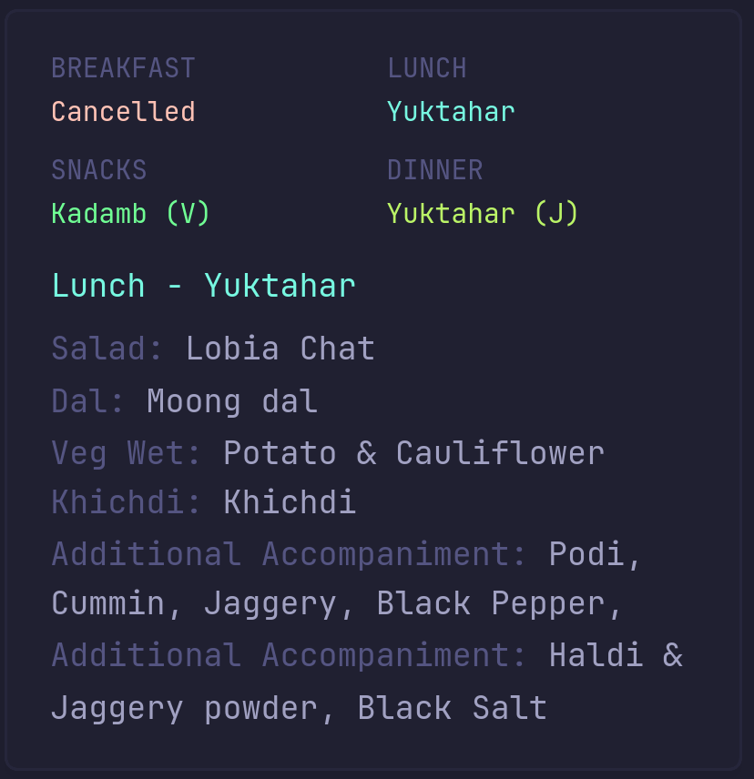](assets/mess/default-yuk.png) | [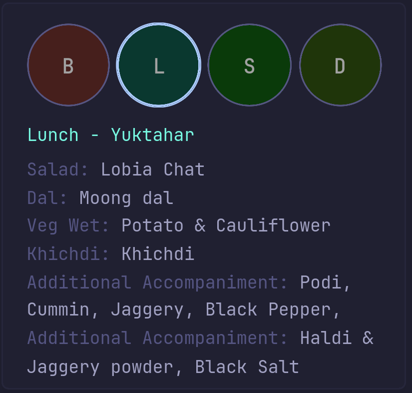](assets/mess/bubbles-yuk.png) | [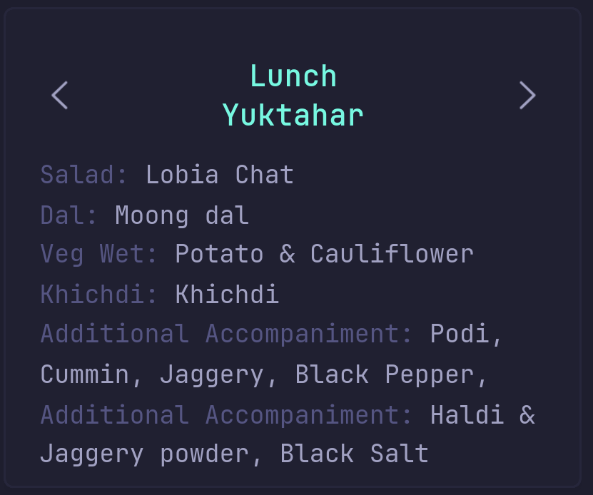](assets/mess/singular-yuk.png) |
| Yuktahar (J) | [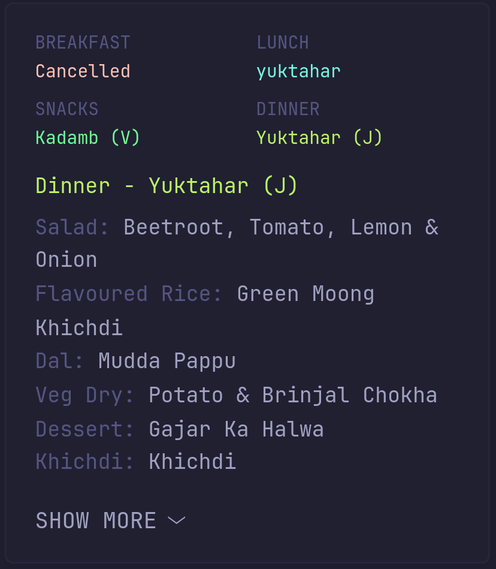](assets/mess/default-yuk-j.png) | [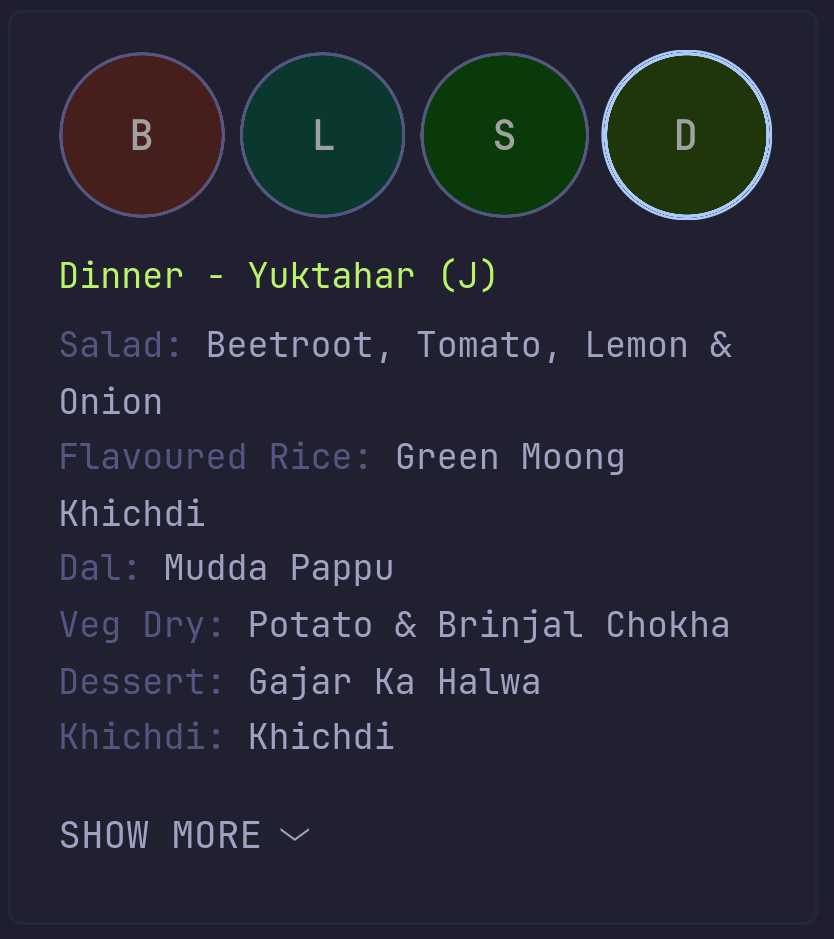](assets/mess/bubbles-yuk-j.png) | [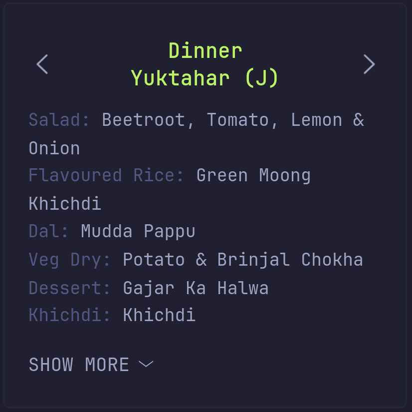](assets/mess/singular-yuk-j.png) |
| Kadamb (V) | [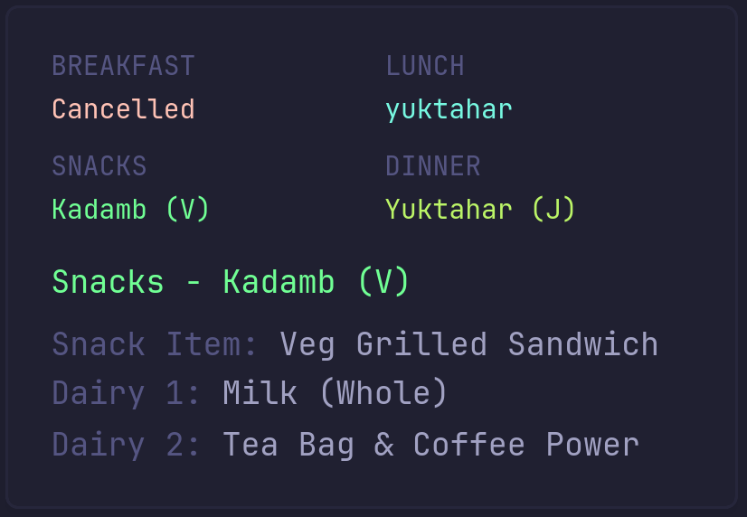](assets/mess/default-v.png) | [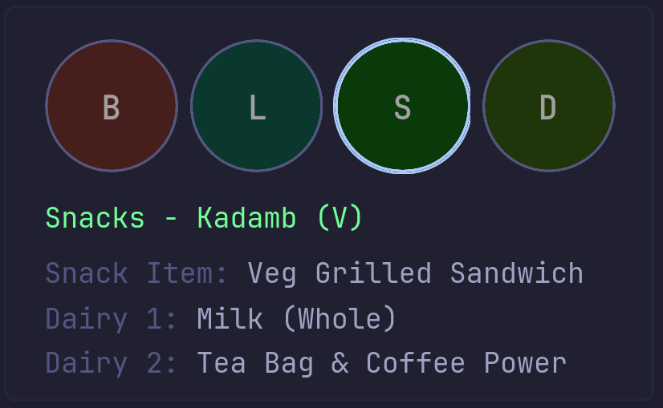](assets/mess/bubbles-v.png) | [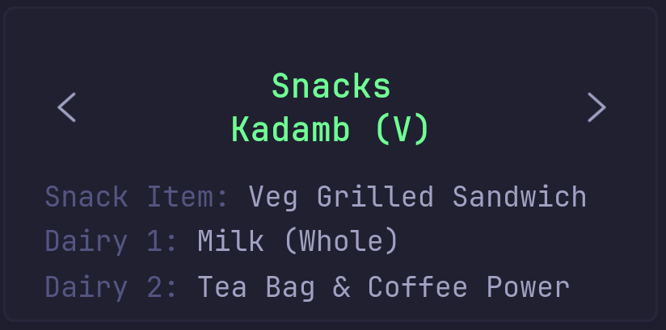](assets/mess/singular-v.png) |
| Kadamb (NV) with extra | [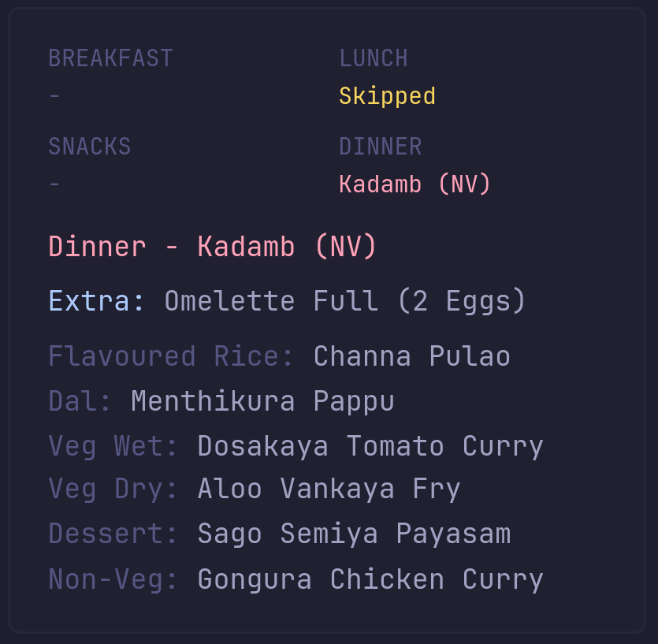](assets/mess/default-nv-extra.png) | [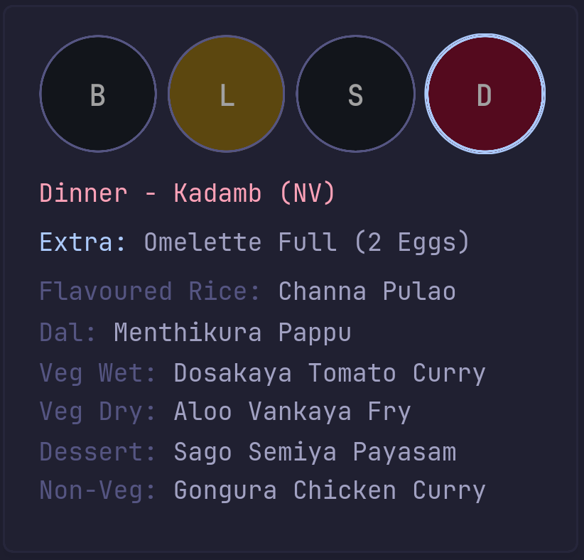](assets/mess/bubbles-nv-extra.png) | [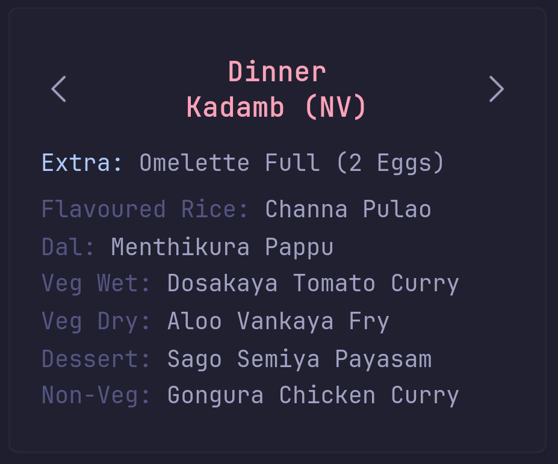](assets/mess/singular-nv-extra.png) |
| Skipped | [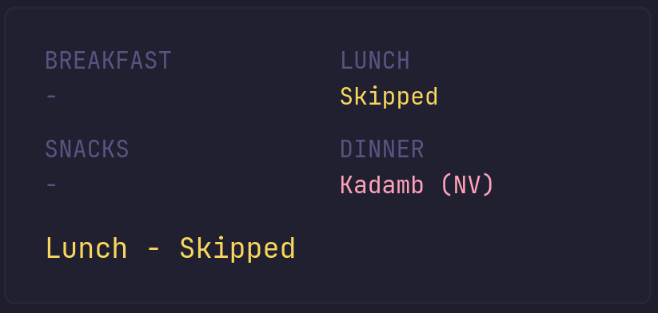](assets/mess/default-skip.png) | [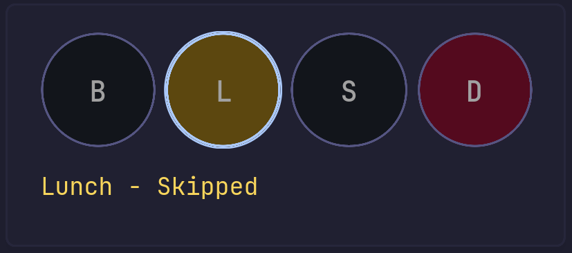](assets/mess/bubbles-skip.png) | [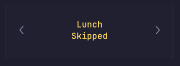](assets/mess/singular-skip.png) |
| Cancelled | [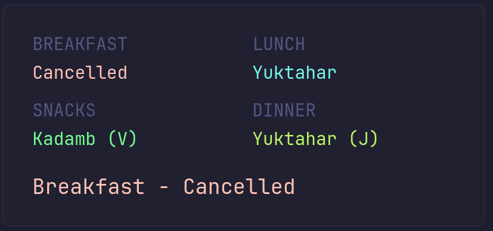](assets/mess/default-cancel.png) | - | [](assets/mess/singular-cancel.png) |
| Not registered | [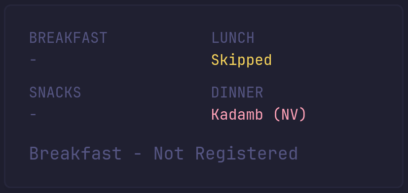](assets/mess/default-noreg.png) | [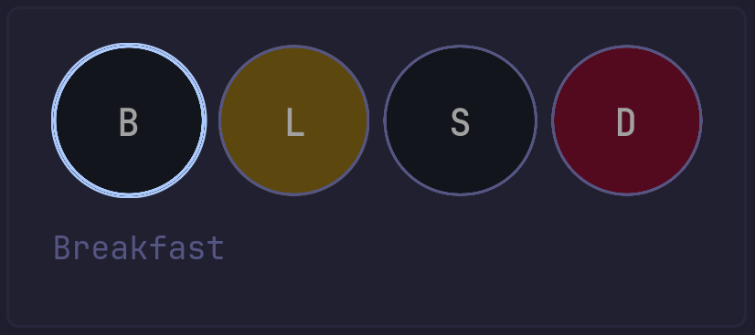](assets/mess/bubbles-noreg.png) | [](assets/mess/singular-noreg.png) |

##### `category-whitelist`

Only show menu categories in this list. Matching is case-insensitive and supports slash-separated category names.

##### `category-blacklist`

Hide menu categories in this list. It cannot be used together with `category-whitelist`.

[Installation Instructions](docs/install-mess.md)

### My Couriers

See every package awaiting collection with its courier provider and relative arrival time.

#### Properties

| Name | Type | Required | Default |
| --- | --- | --- | --- |
| `collapseAfter` | integer | no | `3` |

##### `collapseAfter`

The number of couriers to show before the "SHOW MORE" button appears.

[Installation Instructions](docs/install-courier.md)

### Moodle Timeline

Keep upcoming Moodle assignment deadlines on your dashboard, with direct links, exact due dates, and relative countdowns. The default view includes up to 10 events from the next 60 days and collapses after five.

#### Properties

| Name | Type | Required | Default |
| --- | --- | --- | --- |
| `url` | string | yes | |
| `limit` | integer | no | `10` |
| `lookback_days` | integer | no | `0` |
| `horizon_days` | integer | no | `60` |
| `collapseAfter` | integer | no | `5` |

##### `url`

The Moodle iCalendar feed URL, supplied through `MOODLE_ICAL_URL`.

##### `limit`

The maximum number of assignments to return.

##### `lookback_days`

The number of days before today to include.

##### `horizon_days`

The number of days ahead to include.

##### `collapseAfter`

The number of assignments to show before the "SHOW MORE" button appears.

[Installation Instructions](docs/install-moodle.md)

## How It Works

```text
Glance -> iiith-widgets:8081 -> Caddy -> IIITH OpenVPN -> Mess/Courier APIs
Glance -> iiith-widgets:8081 -> Caddy -> iCal helper -> IIITH OpenVPN -> Moodle calendar
   |
   +-> every other widget -> normal Docker/host internet route
```

The VPN, proxy, and iCal helper share one isolated network namespace. OpenVPN installs only IIITH private-network routes, so neither the host nor unrelated Glance widgets are sent through the college VPN.

## Security

- Caddy accepts only `GET` requests to the exact Mess and Courier API paths used by the widgets.
- Moodle requests are restricted to calendar URLs on `courses.iiit.ac.in`.
- Registration, cancellation, billing, profile, feedback, and other account endpoints return `403`.
- Mess and Courier credentials exist only in the proxy container.
- VPN credentials exist only in the VPN container.
- The Moodle calendar URL is passed only to Glance and the iCal helper.
- The proxy has no published host port and is reachable only from the shared Docker network.

## Credits

Mess API behavior and endpoint discovery are based on [NJP6969/IIITH-mess-MCP](https://github.com/NJP6969/IIITH-mess-MCP).
Moodle calendar parsing uses [AWildLeon/Glance-iCal-Events](https://github.com/AWildLeon/Glance-iCal-Events).

## License

[MIT](LICENSE)
